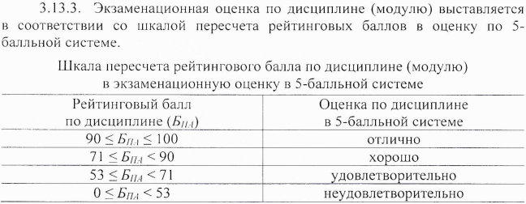

# Алгоритмизация и программирование

- Год поступления студентов: 2021;
- Всего: 180 часов = 32 аудиторная работа + 148 самостоятельная работа;
- Аудиторная работа: 32 часа = 16 часов лекций + 16 часов практики;
- Самостоятельная работа: 148 часов = 112 + 36 (подготовка к экзамену);
- Основной язык: С++;
- Аттестация: экзамен;

*\* Академический час - 45 минут, т.е. пол пары.*

 

## Ссылки на материалы курса

- Курс на мудле: [https://moodle.cfuv.ru/course/view.php?id=21690](https://moodle.cfuv.ru/course/view.php?id=21690);
- Материалы на GitHub: [тут должна быть ссылка на GitHub](#);
- Доступ к практическим заданиям: [заполните форму](https://docs.google.com/forms/d/e/1FAIpQLSdSMPWvcgfM0_Zvoet8sF-B6_vPutoaIJooca8dl4mkN2crAw/viewform?usp=sf_link);

 

## Система оценивания

Порядок расчёта баллов за экзамен - фрагмент приказа №135 от 11.02.2020 "Об утверждении Порядка применения балльно-рейтинговой системы оценивания успеваемости обучающихся по программам ВО в ФГАОУ ВО "КФУ им. В.И. Вернадского":

### Расчёт баллов за работу в семестре (Бсем)

Балл за работу в семестре определяется как сумма баллов по всем контрольным точкам (55 баллов) + бонусные баллы (5 баллов):

$$Б_{сем} = Б_{кт1} + Б_{кт2} + Б_{кт3} + Б_{кт4} + Б_{бонус}$$

**Контрольная точка 1 (1 неделя - 2 неделя): 11 баллов**

- Лекционные занятия:
  - Тест после пары: 1 балл;
- Практические занятия:
  - Посещение: 1 балл;
  - Тест в начале пары: 2 балла;
  - Тест после пары: 1 балла;
  - Выполнение практических задач: 6 баллов;

**Контрольная точка 2 (3 неделя - 4 неделя): 13 баллов**

- Лекционные занятия:
  - Тест после пары: 1 балл;
- Практические занятия:
  - Посещение: 1 балл;
  - Тест в начале пары: 2 балла;
  - Тест после пары: 1 балла;
  - Выполнение практических задач: 8 баллов;

**Контрольная точка 3 (5 неделя - 6 неделя): 13 баллов**

- Лекционные занятия:
  - Тест после пары: 1 балл;
- Практические занятия:
  - Посещение: 1 балл;
  - Тест в начале пары: 2 балла;
  - Тест после пары: 1 балла;
  - Выполнение практических задач: 8 баллов;

**Контрольная точка 4 (7 неделя - 8 неделя): 23 баллов**

- Лекционные занятия:
  - Тест после пары: 1 балл;
- Практические занятия:
  - Посещение: 1 балл;
  - Тест в начале пары: 2 балла;
  - Тест после пары: 1 балла;
  - Выполнение практических задач: 8 баллов;
  - Выполнение кейса: 5 баллов + 5 бонусных.

**Сводная:**

- Лекционные занятия:
  - Тест после пары: 4 балла;
- Практические занятия:
  - Посещение: 4 балла;
  - Тест в начале пары: 8 баллов;
  - Тест после пары: 4 балла;
  - Решение задач: 30 баллов;
  - Выполнение кейса: 5 баллов;
- Бонус: 5 баллов (дополнительно начисляются за выполнение кейса).

### Расчёт баллов за экзамен (Бэкз)

Экзамен проходит в 2 этапа:

- Тестирование. Проверяет полноту освоения курса (простое вопросы, но по всем темам);
- Опрос по билетам. Проверяет глубину освоения материала (несколько вопросов, но подробно).

Каждый этап оценивается отдельно, по 100 балльной шкале. Итоговая оценка за экзамен определяется по формуле:

$$Б_{экз} = 40\cdot\frac{Б_{1}}{100}\cdot\frac{Б_{2}}{100}$$

Если за первый этап получена оценка ниже 50 баллов, то за весь экзамен выставляется оценка *НЕудовлетворительно*, т.к. $Б_{экз}$ гарантировано будет меньше 20 баллов.
