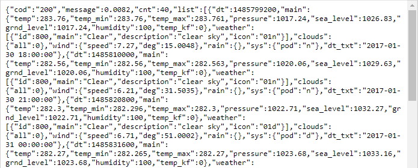

# Сервис прогноза погоды

### Постановка задачи

Разработать сервис предоставляющий данные о погоде в городе Симферополе на момент запроса.  В качестве источника данных о погоде используйте: http://openweathermap.org/.

Сервис предназначен для обслуживания клиентских приложений и минимизации количества запросов к сервису *openweathermap.org*. Сервис должен обеспечивать возможность получения данных в формате JSON и виде *html* страницы.

В качестве клиентского приложения будет использоваться браузер.

### Ход работы

##### 0. Введение. Структура http-запроса

Общая схема http-запроса представлена на рисунке ниже:


<center><i>Рис. 1. Структура http-запроса</i></center>

**Протокол**: http, https, ftp и другие.

**Хост**: доменное имя или ip-адрес сервера. Обычно по одному ip-адресу находится несколько сайтов, в этом случае доменное имя используется сервером, чтобы выбрать правильного получателя запроса.

**Сетевой порт**: число от 0 до 65535. Своеобразное расширения IP-адреса, нужен, чтобы несколько приложений на компьютере одновременно могли работать с сетью. Запрос приходит на IP-адрес, а дальше операционная система отдаёт его тому приложению, которое слушает порт указанный в запросе. Несколько приложений не могут одновременно слушать один и тот же порт благодаря этому пакет Skype не попадёт к Discord и т.д.
Обычно веб сервера слушают 80 и 443 порты. 80 - стандартный порт для http запросов, 443 - для https. Браузеры автоматически дописывают номера портов ориентируясь на название протокола, поэтому пользователю это делать не нужно.

**Путь к ресурсу**: просто строка. Приложение получившее запрос само решает как реагировать на эту строку. В простом случае путь к ресурсу может восприниматься как реальный путь к папке/файлу, где-то на серверном компьютере. В общем случае путь к ресурсу - это способ запустить какую-то функцию в приложении получившем запрос. В результате, функция может как сгенерировать html-страничку и отправить в ответ на запрос, так и запустить процесс форматирования дисков на сервере, если у программы достаточно прав.

**query string**: набор пар ключ-значение. Идёт после вопросительного знака, пары разделены одним амперсантом (&). Если путь к ресурсу воспринимать как функцию, то query string - это аргументы функции. Порядок пар значения не имеет, лишние пары обычно игнорируются.

**Якорь**: служит, для того, чтобы промотать у клиента страницу к нужному элементу (заголовку, картинке и т.д.), поэтому данный параметр не попадает в запрос к серверу. В качестве якоря, например можно указать атрибут *id* *html*-тега.

Примерно тоже, что и выше, но в видео формате: https://youtu.be/DXB-GJKKNcg и https://youtu.be/N5OKXZvIR1w.

##### I. Подготовка к работе с сервисом openweathermap.org

1. Перейдите на главную страницу сервиса [http://openweathermap.org](http://openweathermap.org/);

2. Зарегистрируйтесь и войдите;

3. Перейдите в личный кабинет;

4. В разделе меню ***API keys*** сгенерируйте *API key*;

5. Подождите некоторое время (до 2х часов) пока ключ начнёт работать;

6. Изучите пример использования *API key* [http://openweathermap.org/appid#use](https://openweathermap.org/appid#example);

7. Составьте и протестируйте запрос в браузере (для этого понадобится ваш *API Key*). В ответ вы должны получить текст в формате JSON:

   

   <center><i>Рис. 2. Ответ сервиса openweathermap.org</i></center>

8. Перейдите на главную страницу, а затем в пункт главного меню *API*.

9. В бесплатном тарифе доступны только услуги: *Current Weather Data* и *5 Day / 3 Hour Forecast*. В работе будем использовать последний.

   - Изучите как составить http-запрос к *openweathermap.org* и, что сервис присылает в ответ: [5 day weather forecast](https://openweathermap.org/forecast5);
   - Найдите как получить ответ в градусах Цельсия (по умолчанию Фаренгейты) и на русском языке: [Other features](https://openweathermap.org/forecast5#other);

10. Составьте запрос на получение прогноза погоды для Симферополя, в градусах Цельсия, на русском языке;

11. Протестируйте запрос в браузере. Ответ удобнее изучать в виде дерева, например при помощи [JSON Viewer](https://codebeautify.org/jsonviewer)  или браузерного расширения, например: [JsonDiscovery](https://habr.com/ru/post/461185/). 

##### II. Подготовка к работе с сервисом worldtimeapi.org

Сервис позволяет получить время в формате json, без регистрации. Изучите [примеры запросов](http://worldtimeapi.org/pages/examples), список  [часовых поясов](http://worldtimeapi.org/timezones) и составьте запрос для получения времени в Симферополе.

Протестируйте запрос в браузере и изучите [формат ответа](http://worldtimeapi.org/pages/schema).

**Внимание:** сервис не очень стабильно работает, возможно потребуется отправить несколько запросов.

##### III. Подготовка С++ проекта для получения данных

Для выполнения работы вам понадобится любая локально установленная среда (например Visual Studio) и некоторые дополнительные библиотеки.

Для получения данных от сервисов http://openweathermap.org/ и http://worldtimeapi.org нужно будет посылать им *get*-запросы.

1. Для работы с сетью используйте библиотеку: https://github.com/yhirose/cpp-httplib.
   1. Клонируйте или скачайте в виде архива репозиторий библиотеки https://github.com/yhirose/cpp-httplib;
   
   2. Создайте консольный C++ проект;
   
   3. Перейдите в папку с главным `.cpp` файлом проекта и создайте папку `include`. В ней будут размещаться заголовочные файлы библиотек;
   
   4. Скопируйте файл `httplib.h` из ранее скаченного репозитория в папку `include`. В дальнейшем сам репозиторий больше не потребуется, его можно удалить;
   
   5. Скопируйте и вставьте в главный `.cpp` файл следующий код:
   
      ```c++
      #include <iostream>
      #include "include/httplib.h"
      using namespace httplib;
       
      int main(){
        Client cli("http://worldtimeapi.org");
        auto res = cli.Get("/api/timezone/Europe/Simferopol");
        std::cout << res->body << std::endl;
      }
      ```
   
      Более полная версия с обработкой возможных ошибок и комментариями:
   
      ```c++
      #include <iostream>
      #include "include/httplib.h"
      using namespace httplib;
       
      int main(){
        // Создаём клиент и привязываем к домену. Туда пойдут наши запросы
        Client cli("http://worldtimeapi.org");
        // Отправляем get-запрос и ждём ответ, который сохраняется в переменной res
        auto res = cli.Get("/api/timezone/Europe/Simferopol");
        // res преобразуется в true, если запрос-ответ прошли без ошибок
        if (res) {
          // Проверяем статус ответа, т.к. может быть 404 и другие
          if (res->status == 200) {
            // В res->body лежит string с ответом сервера
            std::cout << res->body << std::endl;
          }else{
            std::cout << "Status code: " << res->status << std::endl;
          }
        }
        else {
          auto err = res.error();
          std::cout << "Error code: " << err << std::endl;  
        }
      }
      ```
   
   6. Запустите программу. В результате вы должны увидеть тот же текст, который вы наблюдали в пункте **II** в браузере.
   
   7. В этом примере мы отправляем *get*-запрос по адресу http://worldtimeapi.org/api/timezone/Europe/Simferopol. Для этого выполняем три действия:
   
         - Создаём переменную с именем *cli* типа *Client* и указываем сайт куда будем отправлять запросы. Это обычная переменная и создавать их можно сколько нужно и где нужно.  
              Нужно указывать только название сайта и только протокол *http*. Для работы с *https* придётся выполнить дополнительные настройки.
            - У переменной *cli* используем метод Get, чтобы отправить get-запрос к сайту с которым связана данная переменная. Для этого в скобочках указываем путь к ресурсу и если нужно *query string*. Например, чтобы обратиться к корню сайта пишем: "/". Метод Get будет ждать ответа от сервера и сохранит его в переменную *res*.
            - Обрабатываем ответ. Важно понимать, что если сервер хоть что-то ответит, то *res* в *if*-e будет *true*. Ошибка может возникнуть, например, если запрос/ответ на дошёл, нет интернета и т.д. Ответ от сервера будет находиться в `res->body`. Это обычное значение типа `std::string`. 
   
   8. Попробуйте отправить запрос к сервису *openweathermap.org* который вы составили в пункте **I.7**
   
   9. Данный проект в дальнейшем не потребуется, он нужен был только, чтобы попрактиковаться отправлять запросы.
   
2. Для работы с JSON используйте библиотеку: https://github.com/nlohmann/json.

   1. Скачайте файл `json.hpp` отсюда: https://github.com/nlohmann/json/releases. Его также можно найти в репозитории проекта https://github.com/nlohmann/json в папке: `single_include/nlohmann`.

   2. Разберём пример чтения данных, которые нам пришли в формате JSON.

   3. Создайте консольный C++ проект;

   4. Перейдите в папку с главным `.cpp` файлом проекта и создайте папку `include`. В ней будут размещаться заголовочные файлы библиотек;

   5. Скопируйте ранее скачанный файл `json.hpp` в папку `include`.

   6. Скопируйте и вставьте в главный `.cpp` файл следующий код:

      ```C++
      #include <iostream>
      #include <string>
      #include "include/json.hpp"
      using json = nlohmann::json;
      using namespace std;
      
      int main()
      {
        // Какой-то текст записаный по правилам JSON
        string str =
      R"({
        "pi": 3.141,
        "happy": true,
        "name": "Niels",
        "answer": {
          "everything": 42
        },
        "list": [1, 0, 2],
        "object": {
          "currency": "USD",
          "value": 42.99
        }
      })";
       
        // Для начала парсим строку и получаем объект JSON
        // Теперь с ним можно работать почти так же как с обычным словарём
        json j = json::parse(str);
       
        // Достаём значения
        double pi = j["pi"];
        cout << "pi " << pi << endl;
       
        bool happy = j["happy"];
        cout << "happy " << happy << endl;
       
        string name = j["name"];
        cout << "name " << name << endl;
       
        double value = j["object"]["value"];
        cout << "value " << value << endl;
       
        cout << "answer is " << j["answer"]["everything"].get<int>() << endl;
       
        // Идём по массиву
        for (int i = 0; i < j["list"].size(); i++)
          cout << "list[" << i << "] = " << j["list"][i] << endl;
      }
      ```
   
   7. В примере используется сырой (*raw*) строкой литерал для записи JSON в тексте программы. Всё, что написано после `R"(` и перед `)";`  воспринимается не как часть кода, а как текст, то есть не нужно экранировать кавычки и все нажатия клавиши <kbd>Enter</kbd> будут записаны в строку как '\n'. Это НЕ является обязательным требованием, и сделано, чтобы не загромождать код лишними символами.
   
   8. Если значение нужно достать и передать в функцию или выполнить с ним какое-то действие, то нужно использовать метод `get<тип>()` с указанием типа данных, например как тут: `j["answer"]["everything"].get<int>()` или `j["name"].get<string>()`.  
      Можно писать и просто `j["name"]`, но в этом случае существует вероятность, что вы получите не то, что ожидаете.
   
   9. Изучите пример.

##### IV. Подготовка С++ проекта для отправки данных

Для выполнения работы вам понадобится не только получать данные от сервисов, но и отправлять их по запросу от браузера.

Чтобы слушать запросы и отвечать на них нам понадобиться совой сервер:

1. Создайте консольный C++ проект;

2. Перейдите в папку с главным `.cpp` файлом проекта и создайте папку `include`.

3. Скопируйте файл `httplib.h` из ранее скаченного репозитория в папку `include`.

4. Скопируйте и вставьте в главный `.cpp` файл следующий код:

   ```c++
   #include <iostream>
   #include "include/httplib.h"
   using namespace httplib;
    
   // В этой функции формируем ответ сервера на запрос
   void gen_response(const Request& req, Response& res) {
     // Команда set_content задаёт ответ сервера и тип ответа:
     // Hello, World! - тело ответа
     // text/plain - MIME тип ответа (в данном случае обычный текст)
     res.set_content("Hello, World!", "text/plain");
   }
    
   int main(){
     Server svr;                    // Создаём сервер (пока-что не запущен)
     svr.Get("/", gen_response);    // Функция gen_response будет вызвана, если кто-то обратиться к корню приложени(сайта)
     std::cout << "Start server... OK\n";
     svr.listen("localhost", 1234); // Запускаем сервер на localhost и порту 1234
   }
   ```

5. Запустите программу и перейдите по ссылке: http://localhost:1234/. Если вы увидели сообщение: `"Hello, World!"`, значит всё сделано правильно.

6. Это базовый проект сервера, в дальнейшем его нужно будет модифицировать.

7. В примере, мы создаём сервер `srv`, затем к *get*-запросу на ресурс `/` привязываем вызов функции `gen_response`. Эта функция получает параметры запроса как аргумент `req` (request) и устанавливает ответ, который наш сервер отправляет на запрос, через параметр `res` (response).  
   В примере мы никак не обрабатываем параметры запроса а в любом случае отправляем в ответ обычный текст `Hello, World!`.

8. Т.к. в качестве клиентского приложения у нас используется браузер, мы должны сообщить ему как воспринимать то, что мы отправляем ему в ответ. Это делается при помощи [MIME типов](https://snipp.ru/handbk/mime-list). В примере выше к качестве такого типа было указано `text/plain`, поэтому браузер отобразить сообщение как простой текст. Если мы хотим, чтобы браузер воспринял текст как html-страницу, то нужно указать MIME `text/html`, а для JSON обычно `application/json`.

Чтобы отправить данные в формате JSON нужно их сначала создать:

1. Создайте консольный C++ проект;

2. Перейдите в папку с главным `.cpp` файлом проекта и создайте папку `include`.

3. Скопируйте ранее скачанный файл `json.hpp` в папку `include`.

4. Скопируйте и вставьте в главный `.cpp` файл следующий код:

   ```C++
   #include <iostream>
   #include <vector>
   #include <string>
   #include <fstream>
   #include "include/json.hpp"
   using json = nlohmann::json;
   using namespace std;
    
   int main()
   {
       // Создаём пустой объект
       json j = json::object();
    
       // {"pi": 3.1415}
       j["pi"] = 3.1415;
    
       // {"pi": 3.1415, "user": {}}
       j["user"] = json::object();
        
       // {"pi": 3.1415, "user": {"name": "John", "age": 20}}
       j["user"]["name"] = "John";
       j["user"]["age"] = 20;
    
       // {"pi": 3.1415, "user": {"name": "John", "age": 20}, "nums": [1, 2, 7]}
       std::vector<int> nums = { 1, 2, 7 };
       j["nums"] = nums;
    
       std::cout << j.dump();  // Преобразовать JSON-объект в текст 
       std::cout << j.dump(2); // 2 пробела перед элементами
    
       // Сохраняем JSON в файл в красивом виде. Получаем обычный текст
       std::ofstream out_file("pretty.json");
       out_file << std::setw(2) << j << std::endl;
    
       // Загружаем JSON из текстового файла
       std::ifstream in_file("pretty.json");
       json new_j;
       in_file >> new_j;
   }
   ```

5. В примере используется, мы сначала создаём пустой JSON-объект. Затем добавляем ключ `pi` со значением 3.1415. Ключ `user` так же будет объектом, в который мы добавляем два поля. Ключ `nums` - это массив целых чисел.

6. Теперь, когда наш объект `j` сформирован его можно преобразовать в текст и вывести на экран. Если указать  в методе `dump` число, то можно получить  JSON-объект в читаемом виде. Без числа все данные будут выведены в одну строку. 

7. Если нужно, есть возможность сохранить объект в файл или загрузить из файла. При этом сам файл - это обычный текст, который можно открыть любым текстовым редактором.

8. Изучите пример.

##### V. Алгоритм работы приложения

Теперь вся необходимая информация для реализации собственного погодного сервиса известна. Осталось его написать.

1. Алгоритм работы приложения:

   1. Сервер запускается и слушает *get* запросы приходящие на 3000 порт *localhost*;
   2. На запрос, Сервер должен ответить информацией о погоде на текущий момент. При этом считается, что данные указанные в прогнозе точны и нет необходимости делать лишний запрос к *openweathermap.org*.
   3. Если приходит запрос на "/", сервер формирует и отправляет html-страницу:
      1. Выполняется запрос на сервис *worldtimeapi.org* для получения точного текущего времени. Для простоты используйте поле `unixtime`;
      
      2. Т.к. запрос на сервис *openweathermap.org* возвращает прогноз на ближайшие пять суток с интервалом в 3 часа, то после запроса к сервису *openweathermap.org* будем сохранять ответ в переменную (далее Кэш). 
      
      3. Если запрос к *openweathermap.org* ещё не делали, то делаем и ответ сохраняем Кэш.
      
      4. Если запрос к *openweathermap.org* уже был, то проверяем, что в Кэше есть информация для требуемого времени. Для простоты будем брать информацию о погоде, на начало следующего часа. То есть в Кэше, в массиве `"hourly"` нужно найти наименьший элемент с меткой времени больше текущей, если просматривать элементы с конца.
      
      5. Если такого элемента нет, значит Кэш устарел. Переходим к пункту 3.
      
      6. После того, как нужные данные найдены загружаем [шаблон страницы](./case_fils/widget_template.html);  
         В данных видеоуроках показано, как работать с файлами: [загружать](https://youtu.be/aUP0eAEIxog) и [сохранять](https://youtu.be/CBnB2fvfu_I). Чтобы загрузить весть текст шаблона в одну строковую переменную можно написать так:
      
         ```C++
         ifstream file("file_name"); // Файловая переменная
         // Тут нужно ещё добавить проверку, что файл успешно открылся.
         string str;                 // Буфер. Тут будет текст файла
         getline(file, str, '\0');   // Читаем все пока не встретим символ '\0'
         ```
      
         В текстовых файлах не должно быть символа '\0' или он может присутствовать в конце файла, поэтому `getline` прочитает весь файл до конца.
      
      7. Далее ищем в шаблоне следующие фрагменты и заменяем на конкретные данные:{hourly[i].weather[0].description}, {hourly[i].weather[0].icon}, {hourly[i].temp};  
         Температуру округлить до целых. Так должна выглядеть [готовая страница](./case_fils/widget.html).  
         Могут пригодиться функции: [find](https://www.cplusplus.com/reference/string/string/find/), [replace](https://www.cplusplus.com/reference/string/string/replace/), [round](https://www.cplusplus.com/reference/cmath/round/), [to_string](https://ru.cppreference.com/w/cpp/string/basic_string/to_string).
      
      8. Заполненный шаблон отправляется в ответ на запрос. Не забудьте поменять MIME на `text/html`.
   4. Если приходит запрос на "/api", сервер формирует и отправляет json:
      1. Выполняется запрос на сервис *worldtimeapi.org* для получения точного текущего времени. Для простоты используйте поле `unixtime`;
      2. Т.к. запрос на сервис *openweathermap.org* возвращает прогноз на ближайшие пять суток с интервалом в 3 часа, то после запроса к сервису *openweathermap.org* будем сохранять ответ в переменную (далее Кэш). 
      3. Если запрос к *openweathermap.org* ещё не делали, то делаем и ответ сохраняем Кэш.
      4. Если запрос к *openweathermap.org* уже был, то проверяем, что в Кэше есть информация для требуемого времени. Для простоты будем брать информацию о погоде, на начало следующего часа. То есть в Кэше, в массиве `"hourly"` нужно найти наименьший элемент с меткой времени больше текущей, если просматривать элементы с конца.
      5. Если такого элемента нет, значит Кэш устарел. Обновляем Кэш и выполняем пункт 4.
      6. После того, как нужные данные найдены формируем новый json содержащий два поля: значения полей hourly[i].temp и hourly[i].weather[0].description исходных данных. Названия полей json-объекта должны быть `temp ` и  `description ` соответственно.
      7. Полученный json отправляем в ответ на запрос. Не забудьте указать правильный MIME.

##### VI. Туннель

Для защиты работы скачайте программу ngrok https://ngrok.com/. Даная программа позволит создать туннель к localhost, то есть из интернета можно будет получить доступ к Серверу запущенному на вашем компьютере, без необходимости иметь "белый" IP- адрес. 

1. Скачайте программу и распакуйте в любое место;

2. Запустите. Откроется окно командной строки;

3. Введите команду: 

   ```
   ngrok.exe http 3000
   ```

4. ngrok запустится и по ссылке указанной в `Forwarding` ваш сервер будет доступен из интернета;

5. Если прописать в браузере http://127.0.0.1:4040 вы увидите статистику по запросам проходящим через туннель.

Видео пример использования (всё что касается регистрации можно пропустить): https://youtu.be/e4igm6JQiHw

##### VII. Защита работы

Защита работы происходит в очном формате, во время практического занятия. Для этого нужно будет:

- Продемонстрировать работу сервиса;
- Ответить на вопросы преподавателя по коду.

Лучше это делать ан своём ноутбуке, т.к. если сервис запустить не удастся, то работа считается не выполненной.